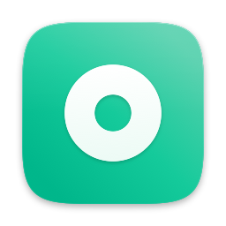

<p align="center">
  
</p>

# Orbly

Your orbiting assistant. (Formerly Verda: see [Migrating from Verda](#migrating-from-verda))

A Slack bot that, when mentioned in a public channel, collects the thread context, hands the
reasoning to a local `claude` or `codex` CLI, and posts the answer back to the same thread under the bot's name.

It connects over Socket Mode, so it needs no public endpoint, and it uses only the minimum bot token scopes.
Used alone, it runs with a Slack app of your own; for a team, a [team hub](#team-hub) holds one Slack app and routes each
member's mentions to that member's own Orbly.

## How it works

```
@bot mention in a public channel
  -> messenger adapter (Slack: Bolt, Socket Mode or the team hub, app_mention event) -> Mention
  -> check allowed users / public channel
  -> post "Working on an answer..." in the thread
  -> collect thread context (the whole thread, or the last 10 messages outside a thread)
  -> Reasoner: claude -p or codex exec (a disposable container when REASONER_SANDBOX=docker)
  -> replace "Working on an answer..." with the answer (long answers continue in more messages)
```

- A mention inside a thread also passes the bot's earlier answers as context, so it continues from them.
- With `MENTION_ALLOWED_USERS` set, the bot answers only those users. Anyone else gets a message only they
  can see (ephemeral): "This bot is only available to specific users."
- It does not answer in private channels or DMs.
- It runs up to `MENTION_CONCURRENCY` requests at once and queues up to 10 more. Beyond that it replies that it is busy.
- On failure it replaces the placeholder message with "Couldn't produce an answer." The channel is public, so error
  details go only to the log.

### Attachments
Files attached to the mention and to the thread are downloaded with the bot token (`files:read`) and passed along. Attachments
of the request message come first, then the thread's recent attachments. Files that arrive in the event as a stub
(`file_access: check_file_info`) are fetched again with `files.info`.

| Kind | Handling | Limits |
| --- | --- | --- |
| Images (png, jpg, gif, webp) | codex: read-only `/attachments` mount + `--image`; claude: base64 blocks on stdin | 10MB each, up to 4 |
| Text (logs, config, code, JSON/YAML/CSV, Slack snippets, SVG) | Content goes into the prompt as an `<attached_file>` data section | 2MB and 50,000 characters per file, 120,000 characters in total |
| PDF | Text of the first 50 pages only, extracted in a disposable container with no network (`pdftotext`) | 20MB, up to 4 together with text files |
| Other formats, external files (Google Drive and so on) | Not read; the model is told the name and the reason | |

- Instructions inside attachments are treated as data only. Downloaded files are kept in `ORBLY_DATA_DIR/attachments/<id>`
  and deleted when the answer is done. (`/tmp` is not used because colima mounts only paths under the home directory into containers.)
- Without the scope, Slack returns a login page instead of the file. This case is reported as "check the files:read scope".

### Diagrams and images
When a diagram helps, the model writes a ` ```mermaid `, ` ```dot ` (graphviz), ` ```vega-lite ` or ` ```svg ` code block.
The bot renders the block as a PNG, posts it to the thread (`files:write`), and leaves only a "(Figure N: image below)" marker in the text.

- Rendering runs in a disposable container with no network (`sandbox/renderer`: mermaid-cli + chromium, graphviz, vl-convert, librsvg,
  Noto CJK fonts). Read-only root, privileges dropped, memory/process limits.
- Up to 3 per answer. A block that cannot be rendered keeps its source with a note, and if the upload fails the source is posted to the thread.
- vega-lite cannot load external data, so values go directly into `data.values`. Without a size, it renders at 520x260.
- `RENDER_DIAGRAMS=off` turns it off. If the renderer image is missing, the startup log says so and the bot works without diagrams.

Illustrations and photo-like images are made with codex's image generation (`image_generation`). (The claude backend has none.)

- codex saves generated images to `~/.codex/generated_images`. In the sandbox container, each request mounts
  `ORBLY_DATA_DIR/attachments/<id>/generated` at `/out`, and the entrypoint links that path to `/out` so the images stay on the host.
  This is the only path the container can write to on the host.
- After the answer, the bot posts the generated images (up to 4) together with the diagrams to the thread. Generation takes about a minute.
- codex generates only fixed sizes (1024x1024, 1536x1024 and so on), so without a size or aspect request it is asked for a square,
  and before upload the renderer container (Pillow) shrinks the long side to `GENERATED_IMAGE_MAX_PX` (default 512). 0 keeps the original.
- Images already in the thread are passed along, so the model can draw with reference to images posted earlier.

| Path | Role |
| --- | --- |
| `src/index.ts` | App assembly: connects the messenger and hands its mentions to the responder |
| `src/messengers/types.ts` | The messenger interface: receiving mentions, context, files, posting, editing, uploads, formatting, links |
| `src/messengers/slack/` | The Slack adapter: connection (Socket Mode or the team hub), user/channel cache, mrkdwn conversion, file downloads |
| `src/mention/` | The messenger-neutral pipeline: allowlist and venue checks, prompt, attachments, run history, resuming after a restart |
| `src/reasoner/` | `claude -p` and `codex exec` wrappers, host/docker executors |
| `src/broker/` | ops-broker: SSH host checks, k8s queries, work directory reads (MCP server) |
| `src/tools/sandbox-job.ts` | Sandbox apply jobs: image builds, proxy, broker (mount preparation, host list), kubeconfig. Shared by the app and `pnpm sandbox:*` |
| `scripts/bundle.mjs` | Bundles the bot, the sandbox jobs and the broker with their dependencies (`pnpm bundle`; used by the packaged app and the broker image) |
| `apps/desktop/scripts/package-mac.mjs` | Installable macOS app and its release zip (`pnpm package:mac`) |
| `src/tools/check-slack.ts` | Slack app config check (`pnpm slack:check`) |
| `sandbox/` | Reasoner container image, egress proxy, compose |
| `deploy/homebrew/` | Homebrew cask template (`Casks/orbly.rb`), tap update script, release runbook |

## Reasoner backends

| REASONER | Runs | Limits |
| --- | --- | --- |
| `claude` (default) | `claude -p --output-format json` | Does not read user settings, hooks or MCP. No tools by default; with `MENTION_WORKSPACE`, only `Read,Grep,Glob` |
| `codex` | `codex exec --sandbox read-only --ephemeral` | The shell tool cannot be turned off, so it is limited by the read-only sandbox and `approval_policy=never` |

## Reasoner sandbox
The requester's message and the thread content become model input as they are. With `REASONER_SANDBOX=docker`, each
request runs the reasoner in a new container that is removed when it finishes.

```
bot (host) --docker run--> reasoner container --(internal network)--> egress-proxy --> allowed domains only
                           |- /workspace  reference directory (read-only, optional)
                           |- HOME, /tmp  tmpfs, empty on every run
                           '- no other host files
```

| Item | Limit |
| --- | --- |
| Filesystem | Read-only root. The only host files visible are the reference directory (ro) and the codex auth file (ro) |
| Network | `internal` network with no external route. Only domains in `~/.orbly/sandbox/allowed-domains.txt` are allowed, via CONNECT on 443 (the file is first created from `sandbox/proxy/allowed-domains.txt`) |
| Privileges | All capabilities dropped, `no-new-privileges`, uid 1000, pids/memory/CPU limits |
| Auth | claude gets `SANDBOX_CLAUDE_OAUTH_TOKEN` or `SANDBOX_ANTHROPIC_API_KEY` passed by environment variable name only (not exposed in process arguments). codex gets `auth.json` mounted read-only and copied to tmpfs |
| On failure | If the image, network or proxy is missing, the startup log says so and reasoner calls fail. It does not fall back to running on the host. |

Per backend:

- `claude`: it has no shell tool, so even inside the sandbox it can consult `/workspace` with `Read,Grep,Glob`.
  Use this combination when you need the reference directory.
- `codex`: inside the hardened container, codex's own sandbox (bubblewrap) cannot create namespaces, so every shell
  command is rejected. This state is kept so the outer isolation is not loosened, and the reference directory is not mounted.
  In other words, it answers from the thread context only. The model and reasoning effort are read from `model` and
  `model_reasoning_effort` in `~/.codex/config.toml` and passed along.

The domain allowlist keeps the model API domains open, so it cannot stop data being sent out through that API.
That is why the sandbox keeps a setup where shell tools do not work (claude has no shell, codex commands are rejected).

Setup:

```sh
pnpm sandbox:build     # build the reasoner image (claude, codex CLIs), the renderer image and the proxy image
pnpm sandbox:up        # start the egress proxy and the internal network (also run after changing the allowed domains)
claude setup-token     # for the claude backend: issue a subscription token -> SANDBOX_CLAUDE_OAUTH_TOKEN in .env
```

In the desktop app, Settings > Sandbox > Reasoner login > "Get token from Claude" does the `claude setup-token` step: it runs
the command (under `script`, which gives it the terminal it needs), you approve in the browser, and the token it prints is
saved to `SANDBOX_CLAUDE_OAUTH_TOKEN` without being shown. The token is a one-year token for your own Claude subscription
(Pro, Max, Team or Enterprise); to keep the bot to your own requests, put your own Slack user ID in `MENTION_ALLOWED_USERS`,
or use the [team hub](#team-hub), where each member's desktop answers only that member. Mounting `~/.claude` into the sandbox
is not an alternative: on macOS the login lives in the Keychain, and the folder holds every past session and your hooks.

The CLI versions are pinned by build args in `sandbox/compose.yaml`. When you upgrade the host CLI, bump them too and rebuild.

## Ops tools (ops-broker)
With `OPS_TOOLS=on`, the reasoner CLI can query operational state and fix code into draft PRs. Credentials and the work directory
are never put into the reasoner container; only a separate relay container (`ops-broker`) holds them. The reasoner container can
only request fixed queries through MCP tools.

```
reasoner container --MCP(http, internal network)--> ops-broker     --ssh OPS_SSH_USER--> inventory hosts (within OPS_SSH_ALLOWED_CIDR)
  (no credentials, no shell or shell rejected)      (keys, tokens) --kubectl (read-only SA)--> OPS_K8S_CONTEXTS clusters
                                                                   --read-only mount--> OPS_FS_ROOT
                                                                   --git(https, user token)--> GitHub (orbly/* branches, draft PRs)
                                                                   --REST(user token, read)--> GitHub (repositories, PR queries)
                                                                   --REST(API token)--> Jira (allowed project queries, issue create/comment)
```

| Tool | What it does | Limits |
| --- | --- | --- |
| `host_list`, `host_check` | Host checks over SSH: `uptime`, `dmesg`, `memory`, `disk`, `top`, `pci_devices`, `failed_units`, `service`, `journal` | Fixed checks with format-validated arguments only. Hosts are named from the host list only, within `OPS_SSH_ALLOWED_CIDR` |
| `k8s_get`, `k8s_describe`, `k8s_logs`, `k8s_events`, `k8s_top` | kubectl queries | Enforced on the cluster side by a read-only SA (`sandbox/k8s/orbly-ro.yaml`, ClusterRole `view` plus cluster-scoped reads). Secrets are blocked by both RBAC and the broker |
| `fs_list`, `fs_find`, `fs_search`, `fs_read` | Work directory reads | Read-only mount. Excludes `.env`, keys, kubeconfig, `*secret*`, `.git`, `.venv` and similar. Rejects paths outside the root and links pointing outside it. Searches must be scoped to a repository or a path inside one |
| `ws_prepare`, `ws_read`, `ws_search`, `ws_list`, `ws_edit`, `ws_write`, `ws_delete`, `ws_diff`, `ws_create_pr` | Code changes and draft PRs | See "Code changes and PRs" below |
| `gh_repo_search`, `gh_pr_list`, `gh_pr_search`, `gh_pr_view`, `gh_pr_diff` | GitHub repository search, PR list/search, PR details (reviews, CI checks, changed files), diff | Read-only. Only `OPS_GIT_ALLOWED_OWNERS` orgs. A repository name without an org is looked up in the allowed orgs; if there is none, similar repositories are suggested |
| `jira_search`, `jira_issue`, `jira_create_issue`, `jira_add_comment` | Jira JQL search, issue details (description, sub-issues and linked issues, recent comments), issue creation, comments | Only `OPS_JIRA_PROJECTS` projects (JQL is pinned to a project condition). Writes happen only on request, are made as the token owner's account, and are limited to 20 per hour. No status changes |

- Every tool output is returned with secret values in common formats, such as tokens and private keys, masked.
- Jira is accessed only with the broker's API token (`OPS_JIRA_TOKEN`). The broker connects directly, so Jira is not added to the proxy's allowed domains.
- GitHub is queried only with the broker's token (`gh auth token`). The reasoner container cannot reach GitHub and has no token.
  codex's ChatGPT app connectors (`codex_apps`, including the GitHub connector) have a different permission scope and send data
  over a different path, so they are turned off in sandbox runs. (`codex exec --disable apps`)
- Every call is logged by the broker (`docker logs orbly-sandbox-ops-broker-1`).
- Because it uses credentials, the bot does not start without `REASONER_SANDBOX=docker` and `MENTION_ALLOWED_USERS`.
- To add checks, edit `src/broker/checks.ts` (SSH) or `src/broker/k8s.ts` and rebuild the broker.

### Code changes and PRs

- `ws_prepare(repo)`: finds `origin` from the local repository directory name and, if it is a repository of an allowed org
  (`OPS_GIT_ALLOWED_OWNERS`), creates a workspace on a `orbly/<date>-<id>` branch from the remote default branch.
  The workspace is a mirror worktree in the broker volume (`ops-work`), so the user's local working tree and changes in progress are not touched.
- Changes are made only with `ws_edit` (exact string replacement), `ws_write` and `ws_delete`. There is no shell and no test run.
  Verification is left to the PR's CI and human review.
- `ws_create_pr`: commits after policy checks, pushes only to `orbly/*` branches, and creates a draft PR.
  - Rejected: no changes, `.github/workflows/`, `.gitmodules`, secret file paths, secret value formats in the diff, more than 50 files, more than 3000 added lines
  - The commit author is `OPS_GIT_AUTHOR_NAME`, `OPS_GIT_AUTHOR_EMAIL`, or, when they are empty, the user in the global git config (`git config --global`).
    This is separate from this repository's git config. PRs are created as the `gh` login account. Limited to 10 per hour.
- The GitHub token is read with `gh auth token` by the broker jobs (`pnpm sandbox:ops-up`, "Recreate broker" in the app) and passed only as a broker environment variable. The model cannot see it.
  It has the `repo` and `workflow` scopes, so in production a fine-grained PAT limited to the target repositories is recommended instead.
- Workspaces are cleaned up after 24 hours.

Setup: no value of the target environment lives in the code; all of them go into `OPS_*` in the config file (`~/.orbly/.env`). Each feature is optional, and the broker starts without the tools of any feature left empty.
Files the broker generates, such as the host list and kubeconfig, are also created outside the repository, in `~/.orbly/ops-broker/`.

| Feature | Settings | If empty |
| --- | --- | --- |
| File reads (`fs_*`) | `OPS_FS_ROOT` | File and PR tools off |
| GitHub queries, PRs (`gh_*`, `ws_*`) | `OPS_GIT_ALLOWED_OWNERS` (+ `gh auth login`, commit author `OPS_GIT_AUTHOR_*`) | GitHub and PR tools off |
| Jira (`jira_*`) | `OPS_JIRA_URL`, `OPS_JIRA_EMAIL`, `OPS_JIRA_TOKEN`, `OPS_JIRA_PROJECTS` | Jira tools off |
| k8s queries (`k8s_*`) | `OPS_K8S_CONTEXTS`, `OPS_K8S_SA`, `OPS_K8S_SA_NAMESPACE` | Empty kubeconfig, k8s tools off |
| Host checks (`host_*`) | `OPS_SSH_USER`, `OPS_SSH_ALLOWED_CIDR`, `OPS_SSH_KEY` (+ `OPS_SSH_KNOWN_HOSTS`) | Host tools off |
| Host list | `OPS_SSH_INVENTORY_DIR`, `OPS_SSH_INVENTORY` (ansible inventory) | Write `~/.orbly/ops-broker/hosts.json` directly |

```sh
# 1) Read-only k8s SA: apply sandbox/k8s/orbly-ro.yaml to every cluster to query
# 2) Build the broker kubeconfig from the SA tokens (reads the token Secrets with the local admin kubeconfig)
pnpm k8s:kubeconfig
# 3) Bundle the broker (pnpm bundle), prepare mounts and the host list, then build and start the broker
pnpm sandbox:ops-up
```

When the inventory or an SA token changes, run the matching command and `pnpm sandbox:ops-up` again.

## Team hub

For several people in one workspace: one hub server holds the Slack app, and each member's Orbly desktop answers that
member's mentions with their own `claude` or `codex` login, sandbox and ops tools.

```
Slack <--Socket Mode--> hub (deploy/hub: Slack tokens, paired desktops) <--WebSocket over HTTPS--> each member's Orbly
```

- The Slack tokens live only on the hub. Desktops never get one: their Slack Web API calls, file downloads and uploads go
  through the hub (`/api/*`, `/files`, `/upload`), which makes them with the bot token.
- The hub allows a desktop only what the thread routed to it needs (`src/hub/policy.ts`): read that thread (and the few
  messages before a mention outside a thread), post in it, edit what it posted, read its files, and upload into it, for
  2 hours after the mention. Other calls are refused with errors like `thread_not_granted` or `method_not_allowed_by_hub`.
- Routing: a mention goes to the desktop of the member who wrote it. Members without a paired desktop, or whose desktop is
  offline, get a message only they can see that says so.
- Pairing: in Orbly, Settings > Messengers > Slack > Team hub, enter the hub URL and choose Connect. Orbly shows a code; send
  `@orbly connect <code>` in a channel Orbly is in, then confirm in Orbly that the Slack account shown is yours.
  The confirmation is what counts, so a code someone else saw and sent first is turned down on the desktop.
  The desktop keeps a random token in `.env` (`HUB_TOKEN`); the hub stores only its SHA-256.
- One desktop per member: pairing again replaces the previous desktop. Settings > Messengers > Slack > Disconnect unpairs it.
- The hub sees mentions and thread content in transit (as Slack's own servers do) and stores only paired desktops.
  Grants are kept in memory, so restarting the hub ends edits to answers in progress.

Running the hub (on a server of its own, with Docker):

1. Create the Slack app from `slack-app-manifest.yaml` (Socket Mode), install it, and create an app-level token with
   `connections:write`.
2. On a machine with the repository: `pnpm install && pnpm bundle`, which writes `deploy/hub/dist/hub.mjs`
   (`pnpm hub:image` also builds the image `orbly-hub:latest`).
3. In `deploy/hub`: `cp hub.env.example hub.env`, fill in `SLACK_APP_TOKEN`, `SLACK_BOT_TOKEN` and `HUB_PUBLIC_URL`
   (optionally `HUB_ALLOWED_USERS`), then `docker compose up -d --build`. Paired desktops are kept in the `hub-data` volume.
4. The hub listens on `127.0.0.1:8790`. Serve it over HTTPS at `HUB_PUBLIC_URL`, for example with Caddy:
   `orbly-hub.example.com { reverse_proxy 127.0.0.1:8790 }` (WebSockets pass through). Desktops accept only https URLs
   (http only for localhost).
5. Give members the URL. `docker compose logs -f hub` shows pairings, connections, routed mentions and refused calls.

| Hub setting (`hub.env`) | Meaning |
| --- | --- |
| `SLACK_APP_TOKEN`, `SLACK_BOT_TOKEN` | The Slack app's tokens (required) |
| `HUB_PUBLIC_URL` | The HTTPS URL members use; upload URLs handed to desktops are built from it |
| `HUB_ALLOWED_USERS` | Comma-separated Slack user IDs who may pair and use the hub. Empty: everyone |
| `HUB_PORT`, `HUB_HOST`, `HUB_DATA_DIR` | Listen port (8790), address (0.0.0.0) and data folder (`/data`) |
| `LOG_LEVEL` | debug, info (default), warn, error |

## Installation

There are two ways to run Orbly: the desktop app from Homebrew, or from source with pnpm. Both need the
Slack app from steps 1-3 under "From source".

### Install with Homebrew

The desktop app installs from the Homebrew tap (macOS 12 or later, Apple silicon or Intel):

```sh
brew tap ashon/tap
brew install --cask orbly
```

- The app carries the bot, the sandbox jobs and its own Node, so it needs no repository, Node or pnpm. It needs Docker
  (Docker Desktop, OrbStack or colima) for the sandbox, a `claude` or `codex` CLI login, and `gh` and `git` for the ops tools.
- After creating the Slack app, open Orbly, enter the Slack tokens in Settings > Messengers > Slack, then run "Build sandbox images"
  and "Restart proxy" in Settings > Sandbox.
- Config, run history and the allowed domains list live in `~/.orbly` (`ORBLY_HOME`), outside the app, so they survive
  upgrades and uninstall.
- `brew upgrade --cask orbly` quits the running app first (the bot gets up to 20 seconds to finish its requests, and the rest
  resume on the next start) and reopens it. `brew uninstall --cask orbly` removes the app and keeps `~/.orbly`.

### From source

1. Slack app: https://api.slack.com/apps -> Create New App -> From an app manifest ->
   paste `slack-app-manifest.yaml`. For an existing app, only match the scopes and events below.
   - Bot Token Scopes: `app_mentions:read`, `channels:history`, `channels:read`, `chat:write`, `files:read`, `files:write`, `users:read`
   - Event Subscriptions > bot events: `app_mention`
   - Turn on Socket Mode
2. Basic Information -> App-Level Tokens: create a token with `connections:write` -> `SLACK_APP_TOKEN`
3. Invite the bot to the public channels where it should answer. (`/invite @botname`)
4. Write the config file and check it. Config lives outside the repository in `~/.orbly/.env`. (`ORBLY_HOME` changes the location)
   The bot (app, terminal), the setup commands and the sandbox compose all read this file, so values of the target environment never land in the repository.

   ```sh
   mkdir -p ~/.orbly && cp .env.example ~/.orbly/.env   # fill in SLACK_*, REASONER, REASONER_SANDBOX
   pnpm install
   pnpm slack:check        # check tokens, scopes, app match, Socket Mode
   ```

5. Run

   ```sh
   pnpm desktop             # the desktop app starts and manages the bot (recommended, see "Desktop app" below)
   pnpm dev                 # development in a terminal (watch)
   pnpm build && pnpm start # run in a terminal
   ```

Two processes with the same app token make Slack split events between them, so run only one.
At startup the bot takes a run lock through `ORBLY_DATA_DIR/bot.json`. If another bot is alive, it waits 30 seconds for it to exit,
and if it is still alive it exits with "Another Orbly bot is running".
`pnpm dev` restarts the process whenever the source changes, so requests in progress can be cut off while you edit code.

Restart handling:

- Mentions in progress are recorded in `ORBLY_DATA_DIR/inflight.json`. After a restart the bot resumes each one once in the same placeholder
  message ("The bot restarted. Resuming the answer..."). Requests already resumed once or older than 30 minutes are replaced with
  "Couldn't produce an answer. The bot restarted and the request was interrupted. Please mention me again."
- On a shutdown signal (SIGINT, SIGTERM) it stops taking new events and waits up to 20 seconds for requests in progress.
- At startup it deletes attachment/output temp directories (`ORBLY_DATA_DIR/attachments/*`) older than 1 hour.

Requirements: Node.js 22.9 or later, pnpm 11, and Docker for the sandbox.

## Desktop app

The desktop app (`apps/desktop`, Electron) starts and manages the bot (Socket Mode) as a child process and shows its status, logs and run history.
The UI is `apps/web` (React).

```sh
pnpm desktop        # build the bot, the UI and the app, then run it from the repository (development)
pnpm desktop:dev    # the UI runs on the Vite dev server (127.0.0.1:5179) and the app opens that address
pnpm package:mac    # build the installable Orbly.app as a release zip in release/
pnpm install:mac    # unpack that zip into /Applications (quit Orbly first)
```

Runs from the repository (`pnpm desktop`, `pnpm desktop:dev`) are named "Orbly Dev": they have their own Electron user data
folder and single-instance lock, so they start next to an installed Orbly. The top bar, the Dock icon (a DEV tag, drawn by
`icon.swift` as `assets/orbly-icon-dev.png`) and the menu bar item say "Dev". Both use the
same config and data folder (`~/.orbly`), so the bot lock still keeps a single bot running.

Packaging:

- `pnpm package:mac` builds `release/Orbly-v<version>-macos-<arch>.app.zip` with a `.sha256` file. The arch defaults to
  this Mac's; `pnpm package:mac --arch x64` builds the Intel app. The app is assembled in `release/staging.noindex` and
  removed once zipped, so Spotlight and Launchpad list only the installed Orbly.
- `pnpm install:mac` checks the zip for this Mac's arch against its `.sha256` and unpacks it into `/Applications`. It refuses to
  replace a running Orbly, or a Orbly installed with Homebrew (`brew uninstall --cask orbly` first).

Using the packaged app:

- `Orbly.app` contains the UI, the bot and sandbox job bundles (`pnpm bundle`) and the `sandbox/` files, so it runs without the repository, Node or pnpm.
  It needs Docker (sandbox), a reasoner CLI login (claude or codex), and gh and git for the ops tools.
- Config (`~/.orbly/.env`), history and the allowed domains list live outside the app (`ORBLY_HOME`, default `~/.orbly`), so they are kept when the app is reinstalled.
- Sandbox apply jobs (image builds, proxy, broker, kubeconfig) run the job bundle inside the app with the app's Node.
  From the repository, the same jobs run with `pnpm sandbox:build`, `sandbox:up`, `sandbox:ops-up` and `k8s:kubeconfig`.
- The packaged app uses its bundles as they are, so it has no "Rebuild and restart". After changing code, reinstall with `pnpm package:mac && pnpm install:mac`.
- To avoid two bots on the same Slack app token, do not run `pnpm desktop` or `pnpm dev` while using the packaged app.
  (If both run, the bot run lock makes the one started later only show "This bot is running elsewhere, such as a terminal.")

Layout:

- The left rail switches sections: "Overview" (with the run list), "Bot", and "Settings" at the bottom. The top bar holds the
  run search (Cmd+K focuses it, Esc clears it); the run list shows next to the overview and run details, while the bot and
  settings screens use the full width.
- The toggle at the left of the top bar (Cmd+B) hides or shows the run list, and the choice is remembered. When the window
  is too narrow for the list and the content side by side (under about 800 pixels), the list opens over the content
  instead: the toggle, Cmd+B or typing a search opens it, and picking a run, Esc or a click outside closes it.
- The window can be as narrow as 600 pixels. Narrow screens stack their cards and rows, and Settings shows its sections as
  icons.
- The status bar at the bottom holds status to glance at: bot connection status, reasoner backend, attached tools, startup check issues (when any),
  requests in progress, and last request time. Clicking the bot status item opens the Bot screen.

Bot management:

- Opening the app starts the bot automatically. (Turn it off with "Start the bot when the app opens" under Settings > General. It is stored in `ORBLY_DATA_DIR/desktop.json`)
- The bot runs as an Electron utilityProcess. Development runs use the repository's `dist/index.js` and run `pnpm build` first when `src` is newer.
  The packaged app uses its bundled bot (`bot/index.mjs`) as is.
  Environment variables are read from the config file (`~/.orbly/.env`) like `node --env-file`, and existing environment variables take precedence.
  PATH comes from the login shell. (So docker, codex and pnpm are found even when the app is launched from Finder)
- The Bot screen has "Start", "Stop", "Restart" and "Rebuild and restart" (development runs only). The number of requests in progress is shown next to the menu bar icon.
- The menu bar (tray) holds only "Open Orbly" at the top, then the bot status ("Bot: ...") with "Start bot" (when stopped) or "Restart bot", and "Quit Orbly".
  App settings (automatic start, run history folder) are in Settings.
- Stop and app quit send SIGTERM. The bot waits up to 20 seconds for requests in progress, and the rest resume on the next start.
- Before launching the bot, the app checks the settings with the bot's own rules. When the Slack tokens are missing (a first run) or a
  value is invalid, it does not launch the bot and shows "Setup needed" with a way to Settings (on the Bot screen, the Overview,
  the status bar, and the tray menu). That way opens the section to fix: Slack for missing or rejected tokens, otherwise the section
  of the first invalid value. Tokens Slack rejects (`invalid_auth` and the like) also end up there. Saving in Settings then starts
  the bot ("Save and start bot").
- If the bot dies after running normally for 30 seconds or more, it shows "Crashed" and is restarted after 3 seconds (up to 3 times in
  10 minutes). If it stops right after starting for another reason, or a dev build fails, it shows "Failed to start" with the cause and
  the last output on the Bot screen.
- If a bot is already running from a terminal (`pnpm dev` and so on), the app leaves it alone and only shows its status and logs as "Running in terminal".
  When the terminal bot stops, the app takes over. (It starts the bot right away if automatic start is on)
- Closing the window hides the app in the tray and the bot keeps running. Quit from the tray menu or with Cmd+Q.
- With `ORBLY_DESKTOP_BOT=off`, the app does not manage the bot and only shows history.

Settings:

- The gear icon at the bottom of the left rail ("Settings") edits the config file (`~/.orbly/.env`). The app and terminal runs use the same file, so settings do not diverge.
- Settings has its own section list (`#/settings/<section>`): General for the app first, then the bot's sections.

  | Section | What it holds |
  | --- | --- |
  | General | Theme, starting the bot with the app, the settings file and run history folder |
  | Messengers | Each chat app under its own heading with how it is connected. Slack: the connection (team hub with pairing, or your own app's tokens) with "Check connection", allowed users, Socket Mode keepalive (advanced) |
  | Answers | Reasoner CLI, model, timeout, concurrent requests, time zone, reference directory, diagrams and images |
  | Sandbox | Run environment (on this Mac or the docker sandbox), limits, the reasoner login, allowed domains, status and apply jobs |
  | Ops tools | The on/off switch with what it needs, then one card per integration: files, GitHub and pull requests, Jira, Kubernetes, SSH hosts |
  | History & logs | Run history and retention, log level |

- The section list shows what needs attention: "Not connected" when Slack tokens are missing, "Apply needed" for changes the sandbox or
  broker has not picked up, "Off" for an unused sandbox or ops tools, and per section the number of unsaved changes or a red dot for
  values to fix. Changes in several sections are saved together from the bar at the bottom, which also names the section with a problem.
- Fields show only when they apply: sandbox limits only for the docker sandbox, and only the selected reasoner's login (claude token or
  codex login file). Hidden values stay in `.env`. Each ops integration card says whether its fields turn it on ("On", "Incomplete", "Off")
  and what the running broker reports. Rarely changed values are collapsed under "Advanced".
  Fields, groups and sections are defined only in `src/settings/fields.ts`, and a test checks that their defaults match the bot config (`src/config.ts`).
- Secret values such as tokens are never sent to the UI. Only the prefix and the last 4 characters are shown; enter a new value to change one.
  The Save button next to the input (or Enter) saves just that value and closes the input; Esc cancels.
- "Check connection" checks the bot token, the bot scopes, that both tokens belong to the same app, and Socket Mode, with the entered tokens (or the current ones).
  (The same checks as `pnpm slack:check`; it only fetches the connection URL and does not connect)
- Before saving, values are validated with the same rules as the bot. Problems are shown next to the field and nothing is saved.
  A value that is only missing (a Slack token, the hub pairing, the sandbox's claude token) does not block saving the rest, so a setup
  can be saved a piece at a time; the bot shows "Setup needed" until it is complete.
- Saving keeps comments, order, and entries the settings screen does not handle (such as personal API keys). Fields reset to their default are emptied as `KEY=`.
  New entries are appended at the end, and the file mode (600) is kept.
- Saved settings take effect after the bot restarts. "Save and restart bot" does both at once.
- A field also set in the app's environment variables takes precedence over `.env`, so the UI marks it.
- Socket Mode keepalive values: `SOCKET_CLIENT_PING_TIMEOUT_MS` (default 5000), `SOCKET_SERVER_PING_TIMEOUT_MS` (default 30000),
  `SOCKET_PING_PONG_LOG` (default off, visible with `LOG_LEVEL=debug`)
- Settings are read and written only over the app's internal IPC, like bot control. The query API and the browser dev server cannot change settings.

Sandbox (the "Sandbox" and "Ops tools" sections of Settings):

- The sandbox has three components, and each applies settings differently. Each section says how its settings apply.

  | Component | Settings | Applied by |
  | --- | --- | --- |
  | Reasoner sandbox (a new container per request) | `SANDBOX_*`, `OPS_TOOLS` | Restarting the bot |
  | Allowed outbound domains (egress-proxy) | `~/.orbly/sandbox/allowed-domains.txt` | Restarting the proxy (`pnpm sandbox:up`) |
  | ops-broker | `OPS_GIT_*`, `OPS_FS_ROOT`, `OPS_SSH_*`, `OPS_K8S_*`, `OPS_JIRA_*` | Recreating the broker (`pnpm sandbox:ops-up`) |

- Status: docker, the 4 images, the proxy and broker containers, broker tools (SSH host count, k8s, files, GitHub, PR, Jira), credential files,
  gh login and git author. Credential values are not read; only their presence is checked.
- Pending changes: components whose changed settings are not applied yet are listed with the reason (for example "Restart proxy needed")
  and can be applied in place.
  - Bot: when the config fingerprint (`configHash`) the bot wrote to its status file at startup differs from the one computed from the current `.env`
  - Proxy: when the allowlist changed after the proxy started, or when the proxy is not running
  - Broker: when the container settings (SSH user, allowed range, GitHub orgs, mount paths) differ from `.env`, when a newer image exists or
    the `src/broker` code is newer than the image, or when the host list or kubeconfig changed after the broker started
- Allowed domains accept exact host names only (wildcards, IPs, ports and URLs are rejected). Domains the current reasoner CLI needs cannot be removed.
  Internal systems that need a token are connected as broker tools instead of opening their domains.
- Apply jobs: "Build sandbox images" (`sandbox:build`), "Rebuild kubeconfig" (`k8s:kubeconfig`), "Restart proxy" and "Recreate broker"
  run from the app and show their output. Only one runs at a time, and secret values in the output are masked.
  Restarting the proxy or the broker cuts off tool calls in progress, so these jobs are blocked while requests are in progress.
- Paths the broker mounts (`OPS_FS_ROOT`, `OPS_SSH_KEY`, `OPS_SSH_KNOWN_HOSTS`) must be absolute. (compose does not expand `~`)

Status and logs:

- The bot writes its status (Socket Mode connection state and reconnect count, bot account, reasoner backend, requests in progress and handled,
  sandbox check problems) to `ORBLY_DATA_DIR/bot.json`. The app reads it the same way no matter who started the bot.
- Logs go to the console and to `ORBLY_DATA_DIR/logs/bot.log`. (Past 5MB it rolls over to `bot.log.1`)
  Bolt and Socket Mode client logs go through the same logger, with the scopes `orbly:socket` and `orbly:bolt`.
  Connects, reconnects, disconnects and received events (envelope, retry count) are logged.
- The log file masks token and key formats and the ticket in the Socket Mode connection URL.
- The Bot screen shows logs as "All", "Socket Mode", "Mentions" or "Warnings and errors", with search. It rereads them every 2 seconds and follows the end.
  With `LOG_LEVEL=debug`, detailed Socket Mode client logs are also written.

Run history:

```
~/.orbly/runs/<YYYY-MM-DD>/<run id>/run.json      # request, context count, attachments, prompt, steps, answer, status
~/.orbly/runs/<YYYY-MM-DD>/<run id>/artifacts/    # images passed to the model, generated images and diagrams posted
```

- The bot records a run for every mention it handles. (`HISTORY=on`, the default)
- Steps are extracted from the CLI's JSON output (codex `--json`, claude `stream-json`): messages, thinking, tool calls (arguments, results,
  duration), shell commands and token usage. Tool results are stored up to 8,000 characters.
- Statuses are "Running", "Succeeded", "Failed" and "Interrupted". A request resumed after a restart continues in the same record
  ("Resumed after a bot restart (attempt 2)"), and records that will not be resumed are marked "Interrupted" at startup.
- Date directories older than `HISTORY_RETENTION_DAYS` (default 30 days) are deleted. Change the location with `ORBLY_DATA_DIR`.
- Records contain thread context and attachment contents, so they stay local.
- UI: run list (status filter, search), "Overview" (last 14 days, success rate, average duration, top tools), run detail ("Timeline" of the work
  in the order request -> tool calls -> answer -> outputs, "Attachments", "Prompt", raw "JSON"). Runs in progress are reread every 1.5 seconds.

Other:

- The query API is served only inside the app at `orbly://app/api/*`, with no open port. Bot control uses preload IPC only.
  The dev server (`apps/web` Vite) listens only on 127.0.0.1 and attaches the same query API read-only.
- The data location is taken from the `ORBLY_DATA_DIR` environment variable, then `ORBLY_DATA_DIR` in the config file, then the
  default home (`~/.orbly`, or `~/.verda` while `~/.orbly` does not exist; see "Migrating from Verda").
- App icon: `assets/orbly-icon.svg` is the source. After editing it, `pnpm --filter @orbly/desktop icon` (macOS swift) redraws
  the same shape on the macOS icon grid (an 824 body in 1024, shadow, highlight) as `assets/orbly-icon.png`.
  Development runs use the PNG as the Dock icon as is, so this does the system's processing by hand.
- `ORBLY_DESKTOP_THEME=light|dark` pins the theme. (The default follows the system; it can also be changed under "Theme" in Settings > General)
- Build check: `ORBLY_DESKTOP_CAPTURE=/tmp/orbly.png pnpm --filter @orbly/desktop start` saves the UI as a PNG without showing
  a window, then exits. (`ORBLY_DESKTOP_CAPTURE_HASH=#/bot` picks the screen, and `ORBLY_DESKTOP_CAPTURE_WIDTH` and
  `ORBLY_DESKTOP_CAPTURE_HEIGHT` the window size; the bot is not started in this mode)

## Migrating from Verda

The project was renamed from Verda to Orbly, and the repository moved to [Ashon/orbly](https://github.com/Ashon/orbly)
(old links redirect; for a clone, `git remote set-url origin git@github.com:Ashon/orbly.git`). The Homebrew cask is now
`orbly`. An existing Verda setup keeps working, with warnings in the bot log and the terminal:

- `VERDA_*` environment variables (in the environment or in `.env`) are read as their `ORBLY_*` names when those are not set.
- When `~/.orbly` does not exist and `~/.verda` does, Orbly uses `~/.verda`. User data is never moved or copied.
- The bot looks for a running bot in both `~/.orbly` and `~/.verda`, so an old Verda.app and the new Orbly.app never
  connect to Slack at the same time.
- Run history and logs written by Verda show in the Orbly app as they are.
- The broker creates `orbly/*` branches and still recognizes `verda/*` branches as its own.
- The k8s account defaults to `orbly-ro` in the `orbly` namespace (`sandbox/k8s/orbly-ro.yaml`). To keep the old account,
  set `OPS_K8S_SA=verda-ro` and `OPS_K8S_SA_NAMESPACE=verda` in `.env`.

To migrate by hand:

1. Stop the bot (quit Verda.app, or stop `pnpm dev`).
2. `mv ~/.verda ~/.orbly`
3. In `~/.orbly/.env`, rename the `VERDA_*` keys to `ORBLY_*` (for example `VERDA_DATA_DIR` to `ORBLY_DATA_DIR`). Remove
   explicit `SANDBOX_IMAGE=verda-reasoner:latest`, `SANDBOX_NETWORK=verda-sandbox` or `RENDERER_IMAGE=verda-renderer:latest`
   lines so the new `orbly-*` defaults apply, then rebuild the images (Settings > Sandbox, or `pnpm sandbox:build` and
   `pnpm sandbox:up`; `pnpm sandbox:ops-up` for the broker).
4. With Homebrew, `brew update && brew upgrade` moves the `verda` cask to `orbly` (the tap renames it) and replaces
   Verda.app with Orbly.app. If brew keeps listing `verda`, run `brew uninstall --cask verda && brew install --cask orbly`.
   Without Homebrew, remove `/Applications/Verda.app` and install Orbly.app.
5. Start Orbly. Old `verda-*` images, the `verda-sandbox` containers and network can then be removed
   (`docker compose -p verda-sandbox down`, `docker image rm verda-reasoner verda-renderer verda-egress-proxy verda-ops-broker`).

## Development

```sh
pnpm check   # typecheck (bot, UI, app) + lint + format:check + test
pnpm test
```

### Adding a messenger

The mention pipeline (`src/mention`) talks to chat apps only through `Messenger` in `src/messengers/types.ts`, so a new
app is an adapter, not a change to the pipeline:

1. Add its id to `src/messengers/ids.ts`.
2. Write `src/messengers/<id>/`: a `Messenger` (who may ask and where, the readable request and context, file lookups
   and downloads, posting, editing, uploads, rendering Markdown into the app's markup) and a `MessengerConnection` that
   turns the app's events into `Mention`s. `src/messengers/slack/` is the reference.
3. Connect it in `src/index.ts` and pass its messenger to `MentionResponder`.
4. Give its settings groups `messenger: "<id>"` in `src/settings/fields.ts`; the Messengers section shows them under
   the app's heading.

Run history (`origin.messenger`) and interrupted requests (`inflight.json`) already record which messenger a request
came from.
