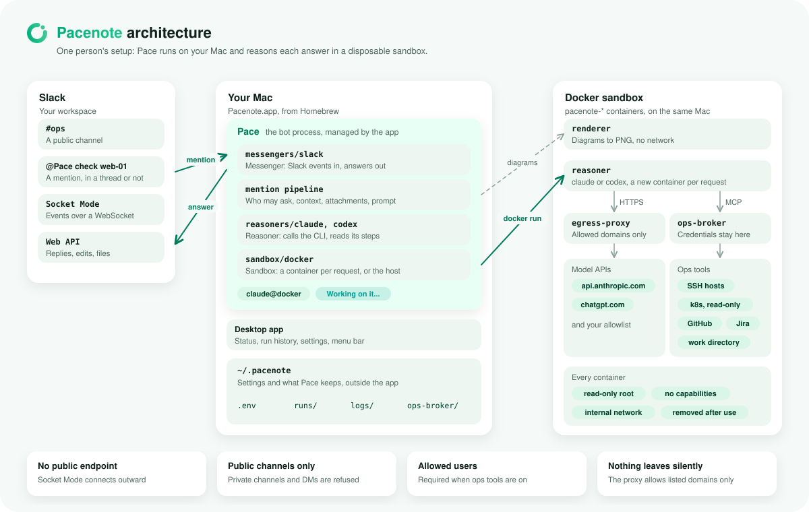

<p align="center">
  
</p>

# Pacenote

[](https://github.com/Ashon/pacenote/actions/workflows/ci.yml)
[](https://github.com/Ashon/pacenote/actions/workflows/ci.yml)

**You drive. Pacey reads the notes.**

In rallying, the co-driver reads pace notes so the driver can keep their eyes on the road. Pacenote puts Pacey in that
seat for your team's Slack: mention `@Pacey` in a public channel, and Pacey reads the thread, hands the reasoning to a
local `claude` or `codex` CLI on your machine, keeps only what matters now, and answers in the same thread.

Two names, two roles: **Pacenote** is the project and the app; **Pacey** is who you talk to, the Slack bot and the
voice of the app. (Formerly Orbly and Verda: see [Migrating](docs/migrating.md).)

<picture>
  <source media="(prefers-color-scheme: dark)" srcset="docs/diagrams/architecture-dark.svg">
  
</picture>

## What it does

- Answers mentions in the thread, with the thread and its attachments (text, images, PDFs) as context.
- Reasons with your own `claude` or `codex` CLI login, in a disposable Docker sandbox that reaches only allowed domains.
- Optional ops tools: read-only lookups on servers, k8s clusters and a work directory, GitHub and Jira, and code
  changes as draft PRs, through a broker that keeps credentials out of the reasoner.
- Renders diagrams and charts to images, and keeps a run history with every tool step in the desktop app.
- Connects over Socket Mode, so it needs no public endpoint. A team can share one Slack app through a
  [team hub](docs/team-hub.md), which routes each member's mentions to their own desktop.

## Install

The desktop app installs with Homebrew (macOS 12 or later, Apple silicon or Intel):

```sh
brew tap ashon/tap
brew install --cask pacenote
```

Then:

1. Run Docker (Docker Desktop, OrbStack or colima), and log in to `claude` or `codex`.
2. Create the Slack app: [api.slack.com/apps](https://api.slack.com/apps) > Create New App > From an app manifest >
   paste [`slack-app-manifest.yaml`](slack-app-manifest.yaml), install it to your workspace, and create an app-level
   token with `connections:write`. (On a team with a hub, pair with the hub instead: see [Team hub](docs/team-hub.md).)
3. Open Pacenote. In Settings > Messengers > Slack, save the app token and the bot token. Allowed users limits who can ask.
4. In Settings > Sandbox, run "Build sandbox images" and "Restart proxy".
5. Invite `@Pacey` to a public channel and mention it.

`brew upgrade --cask pacenote` updates the app. Config and run history live in `~/.pacenote` and are kept across
upgrades and uninstalls. To run from source instead, see [Installation](docs/installation.md).

## Documentation

| Doc | What it covers |
| --- | --- |
| [Architecture](docs/architecture.md) | The design in four diagrams: the pieces, one mention, the team hub, the code layout |
| [How it works](docs/how-it-works.md) | The path from a mention to its answer, attachments, diagrams and images, the reasoner CLIs |
| [Reasoner sandbox](docs/sandbox.md) | The Docker sandbox, the egress proxy and allowed domains, the sandbox's claude or codex login |
| [Ops tools](docs/ops-tools.md) | ops-broker: hosts, k8s, work directory, GitHub, Jira, and code changes as draft PRs |
| [Team hub](docs/team-hub.md) | One Slack app for a team, with each member's desktop answering their own mentions |
| [Installation](docs/installation.md) | Homebrew in detail, running from source, restarts and the run lock |
| [Desktop app](docs/desktop-app.md) | The app's screens, bot management, settings, sandbox controls, packaging |
| [Migrating](docs/migrating.md) | Moving from Orbly or Verda |
| [Development](docs/development.md) | Checks, end-to-end tests and coverage, adding a messenger |
| [Releases](docs/releases) | Release notes |

## Development

```sh
pnpm install
pnpm check      # typecheck, lint, format, unit tests
pnpm test:e2e   # the bot and the hub against a local Slack stand-in
pnpm desktop    # the desktop app from source
```

See [Development](docs/development.md) for more.
