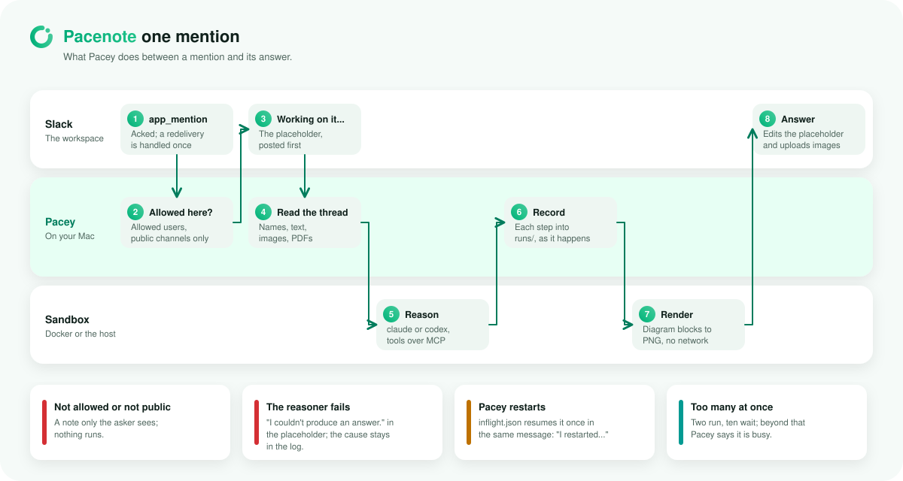
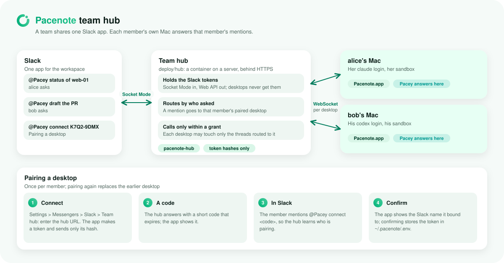
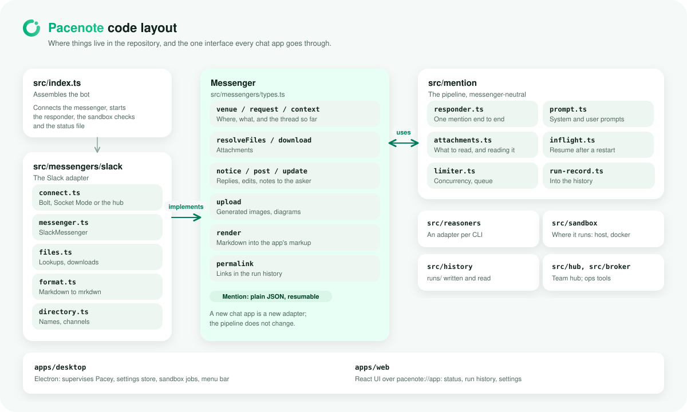

# Architecture

How Pacenote is put together, in four pictures. The diagrams are drawn by `scripts/diagrams.mjs`
(`pnpm docs:diagrams`) in the desktop app's look, with a light and a dark variant.

## The pieces

Pacey, the bot, runs on your Mac as a process the desktop app manages. Slack reaches it over Socket Mode, so nothing
listens on a public port. Every answer is reasoned by your own `claude` or `codex` CLI in a disposable container whose
only ways out are the egress proxy (allowed domains) and ops-broker (ops tools, with the credentials kept in the
broker). Settings and everything Pacey keeps live in `~/.pacenote`.

<picture>
  <source media="(prefers-color-scheme: dark)" srcset="diagrams/architecture-dark.svg">
  
</picture>

More: [How it works](how-it-works.md), [Reasoner sandbox](sandbox.md), [Ops tools](ops-tools.md),
[Desktop app](desktop-app.md).

## One mention

A mention is checked (allowed users, public channels), answered with a placeholder at once, and reasoned with the
thread and its attachments as context. Each step goes into the run history as it happens, diagram blocks are rendered,
and the answer replaces the placeholder. A restart resumes an unfinished answer once, in the same message.

<picture>
  <source media="(prefers-color-scheme: dark)" srcset="diagrams/mention-flow-dark.svg">
  
</picture>

## Team hub

For a team, one hub server holds the Slack app and routes each member's mentions to that member's own desktop, which
answers with that member's login, sandbox and tools. Desktops pair once with a code sent to Pacey in Slack and never
hold a Slack token.

<picture>
  <source media="(prefers-color-scheme: dark)" srcset="diagrams/team-hub-dark.svg">
  
</picture>

More: [Team hub](team-hub.md).

## Code layout

The mention pipeline (`src/mention`) talks to chat apps only through the `Messenger` interface
(`src/messengers/types.ts`); Slack is its first adapter. Adding a chat app means adding an adapter, not changing the
pipeline.

<picture>
  <source media="(prefers-color-scheme: dark)" srcset="diagrams/code-layout-dark.svg">
  
</picture>

More: [Development](development.md), including how to add a messenger.
